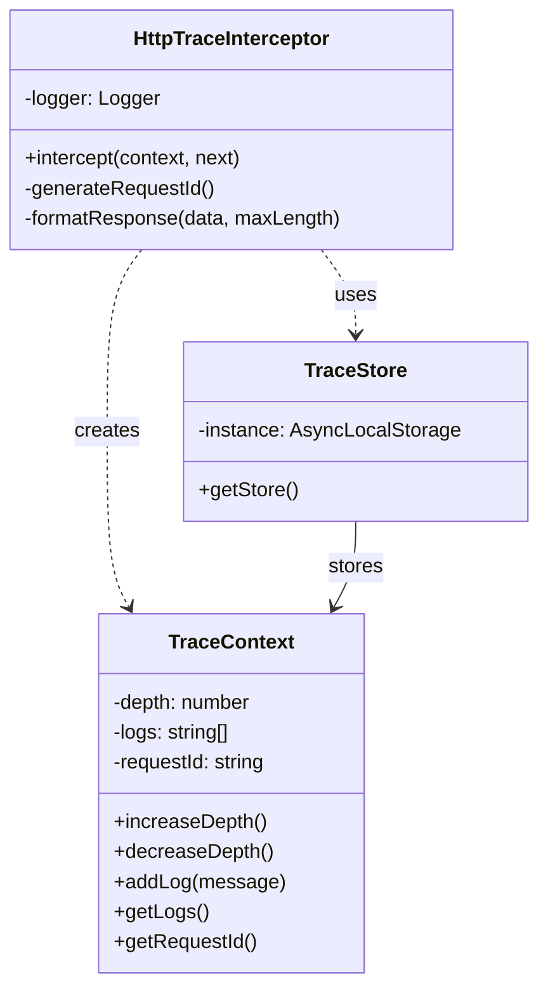
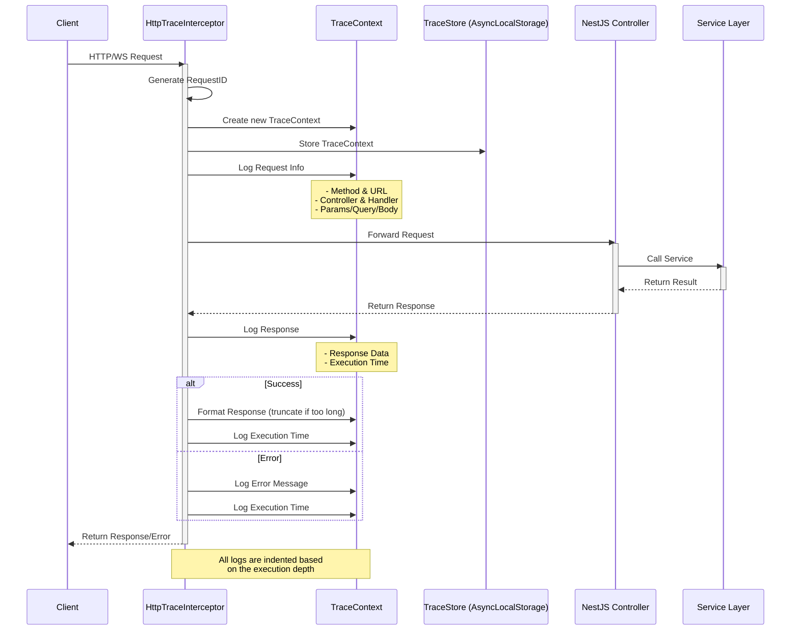

# HTTP Trace Interceptor

NestJS 애플리케이션의 HTTP 요청과 WebSocket 이벤트를 추적하고 로깅하는 인터셉터입니다.

## 필요성
- 새로운 프로젝트를 이어받아 개발을 진행해야 하는 상황
- logging 기능이 없어 어느 요청에서 에러가 생기는지 파악하기 어려운 상황
- request가 어느 controller에서 처리되는지 파악하기 어려운 상황
- 디버깅하기 매우 어려움
- 이를 로깅으로 해결하고자 함

## 기능

- HTTP 요청과 WebSocket 이벤트 추적
- 요청/응답 데이터 로깅
- 실행 시간 측정
- 에러 추적
- JSON 응답 포맷팅
- 비동기 컨텍스트별 로그 관리


### HTTP 요청 로그 예시

```
[Nest] 25536  - 2025. 01. 08. 오후 4:20:35     LOG [TraceLogger] HTTP REQ-1736320835769-o9wtoggd5
[Request] GET /api/stock/fluctuation?limit=10&type=increase
[Controller] StockController.getTopStocksByFluctuation
[Query] {"limit":"10","type":"increase"}
[Response] {
  "result": [
    {
      "id": "005800",
      "name": "신영와코루",
      "currentPrice": 12350,
      "volume": 1348930,
      "marketCap": null,
      "changeRate": 30,
      "rank": 1,
      "isRising": true
    },

```


## 주요 클래스

### 시각화




### HttpTraceInterceptor

HTTP 요청과 WebSocket 이벤트를 가로채서 로깅하는 메인 인터셉터

```typescript
@Injectable()
export class HttpTraceInterceptor implements NestInterceptor {
  private readonly logger = new Logger('TraceLogger');
  // ...
}
```

### TraceContext

각 요청/이벤트에 대한 로그를 관리하는 클래스

```typescript
class TraceContext {
  private depth = 0;
  private logs: string[] = [];
  private requestId: string;
  // ...
}
```

### TraceStore

AsyncLocalStorage를 사용하여 요청별 TraceContext를 관리

```typescript
class TraceStore {
  private static instance = new AsyncLocalStorage<TraceContext>();
  // ...
}
```

### AsyncLocalStorage를 사용하는 이유
 **비동기 실행 컨텍스트 간에 데이터를 공유**하기 위해서 사용.

1. **동시 요청 처리의 독립성**
```typescript
class TraceStore {
  private static instance = new AsyncLocalStorage<TraceContext>();
  // 각 요청은 자신만의 TraceContext를 가짐
}
```
- 여러 요청이 동시에 들어와도 각 요청의 로그가 섞이지 않음
- 각 요청은 독립된 컨텍스트에서 처리됨

2. **비동기 호출 체인에서의 컨텍스트 유지**
```typescript
TraceStore.getStore().run(traceContext, async () => {
  // 여기서 생성된 컨텍스트는
  await serviceA.doSomething(); // 이 비동기 호출과
  await serviceB.doSomething(); // 이 비동기 호출에서도
  await serviceC.doSomething(); // 이 비동기 호출에서도 유지됨
});
```

3. **전역 변수 사용의 문제점 해결**
```typescript
// ❌ 전역 변수 사용시 - 요청간 데이터가 섞일 수 있음
let currentRequestId = '';

// ✅ AsyncLocalStorage 사용시 - 각 요청이 독립적
const store = new AsyncLocalStorage<TraceContext>();
```

4. **요청 추적의 정확성**
```typescript
// Controller
@Get()
async findAll() {
  // 이 요청의 TraceContext
  await this.service.findItems(); // 서비스 호출
  await this.cache.get();        // 캐시 호출
  // 모든 호출이 같은 TraceContext를 공유
}
```

AsyncLocalStorage 가 없는경우 발생할 수 있는 문제:
```typescript
// ❌ AsyncLocalStorage 없이
let currentRequestLog = [];

// 요청 1
app.get('/users', async (req, res) => {
  currentRequestLog.push('Request 1 started');
  await someAsyncOperation();  // 이 동안 다른 요청이 들어올 수 있음
  currentRequestLog.push('Request 1 ended');
});

// 요청 2 (동시에 실행될 수 있음)
app.get('/posts', async (req, res) => {
  currentRequestLog.push('Request 2 started');  // 로그가 섞임!
  await someAsyncOperation();
  currentRequestLog.push('Request 2 ended');
});
```

```typescript
// ✅ AsyncLocalStorage 사용
const store = new AsyncLocalStorage<string[]>();

app.get('/users', async (req, res) => {
  store.run([], async () => {
    store.getStore().push('Request 1 started');
    await someAsyncOperation();
    store.getStore().push('Request 1 ended');
    // 이 요청의 로그만 독립적으로 유지됨
  });
});
```

실제 적용 예시:
```typescript
@Injectable()
export class HttpTraceInterceptor implements NestInterceptor {
  intercept(context: ExecutionContext, next: CallHandler): Observable<any> {
    const traceContext = new TraceContext(requestId);

    return new Observable(subscriber => {
      // 이 컨텍스트는 전체 요청 처리 과정에서 유지됨
      TraceStore.getStore().run(traceContext, () => {
        // 컨트롤러 실행
        // 서비스 호출
        // 데이터베이스 쿼리
        // 모두 같은 traceContext를 공유
      });
    });
  }
}
```

이렇게 AsyncLocalStorage를 사용함으로써:
- 동시성 문제 해결
- 코드의 가독성 향상
- 요청 추적의 정확성 보장


## 로그 형식

### 기본 구조

- Request ID: 각 요청의 고유 식별자
- 요청 정보: 메서드, URL, 컨트롤러, 핸들러
- 파라미터: Query, Body, Path Parameters
- 응답 데이터: JSON 형식 (긴 응답은 자동 축소)
- 실행 시간: 밀리초 단위

### 응답 데이터 포맷팅
- 너무 긴 응답발생시 로그를 한눈에 파악하기 어려운 문제 발생
- 긴 응답은 자동으로 축소:
```typescript
private formatResponse(data: any, maxLength: number = 1000): string {
  const formatted = JSON.stringify(data, null, 2);
  if (formatted.length <= maxLength) {
    return formatted;
  }
  return formatted.substring(0, maxLength) + '... (response truncated)';
}
```

## 실행 흐름

1. 요청/이벤트 수신
2. RequestID 생성
3. TraceContext 생성
4. 요청 정보 로깅
5. 요청 처리
6. 응답/에러 로깅
7. 실행 시간 계산
8. 로그 출력

## 결론
- HTTP 요청과 WebSocket 이벤트를 추적하고 로깅하는 인터셉터를 구현
- 처음 보는 프로젝트의 로직 파악과 디버깅에 도움