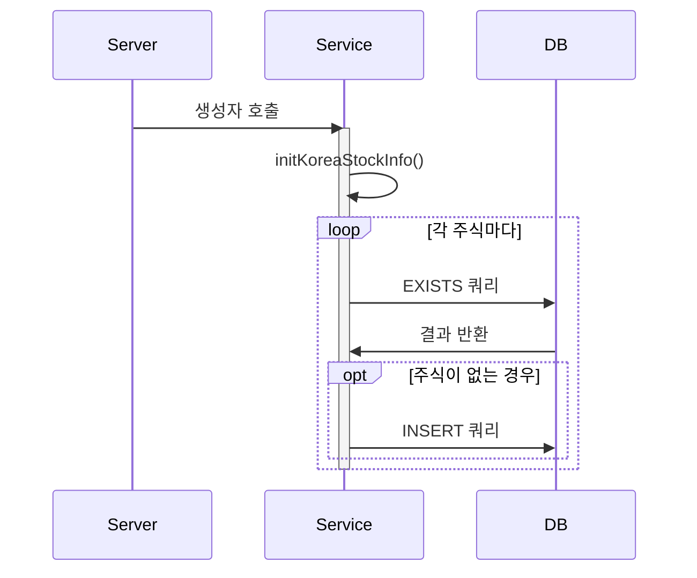
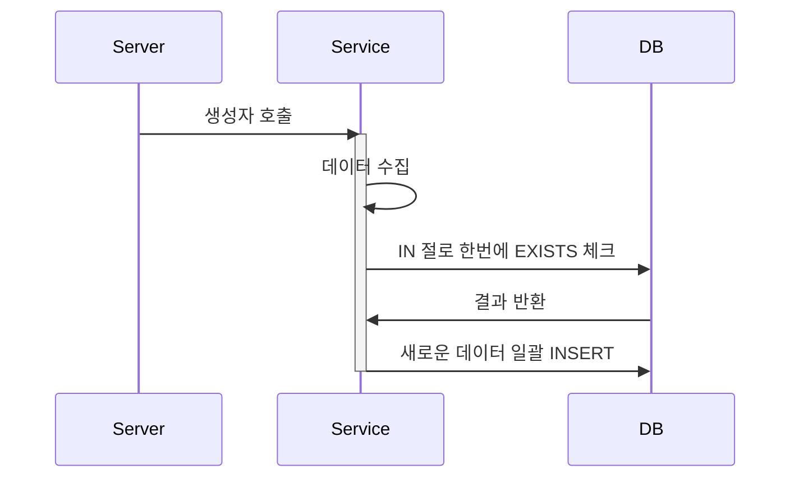

## 🚨 서버 시작하자마자 수백 개의 쿼리가 발생한다고요? - Constructor에서의 순차적 쿼리 실행 함정

### 1. 발견된 문제
```typescript
Query: SELECT 1 AS `row_exists` FROM ... WHERE EXISTS (SELECT 1 FROM `stock` WHERE stock_id = ?) 
Parameters: ["040300"]
Query: SELECT 1 AS `row_exists` FROM ... WHERE EXISTS (SELECT 1 FROM `stock` WHERE stock_id = ?) 
Parameters: ["040350"]
// ... 수백 개의 쿼리 계속 발생
```

### 2. 원인 분석
```typescript
@Injectable()
export class KoreaStockInfoService {
    constructor(...) {
        this.initKoreaStockInfo();  // 생성자에서 초기화 메서드 호출
    }

    private async insertStockData(stock: Stock): Promise<void> {
        const exists = await this.existsStockInfo(stock.id!, manager);  // 각각의 주식마다 EXISTS 체크
        if (!exists) {
            await manager.save(Stock, stock);
        }
    }
}
```

### 3. 프로세스 비교

#### 기존 방식 (순차적 실행)


#### 개선된 방식 (배치 처리)


### 4. 개선된 코드
```typescript
private async insertStockDataBatch(stocks: Stock[]): Promise<void> {
    // 한 번의 쿼리로 존재하는 모든 stock_id 확인
    const existingStocks = await manager
        .createQueryBuilder(Stock, "stock")
        .select("stock.id")
        .where("stock.id IN (:...ids)", { 
            ids: stocks.map(s => s.id) 
        })
        .getRawMany();

    // 새로운 데이터만 필터링
    const existingIds = new Set(existingStocks.map(s => s.id));
    const newStocks = stocks.filter(s => !existingIds.has(s.id));
    
    // 일괄 저장
    if (newStocks.length > 0) {
        await manager.save(Stock, newStocks);
    }
}
```

### 5. 성능 개선 효과
| 항목 | 기존 방식 | 개선된 방식 |
|------|-----------|------------|
| DB 쿼리 수 | 주식 수 × 2 (최대) | 2 (EXISTS + INSERT) |
| 실행 시간 | O(n) | O(1) |
| DB 부하 | 높음 | 낮음 |

### 6. 핵심 교훈
1. 생성자에서 무거운 초기화 작업 주의
2. 순차적 쿼리보다 배치 처리 활용
3. 데이터베이스 부하 고려한 설계 필요

### 7. 연관된 패턴
- 생성자 주입 (Constructor Injection)
- 배치 처리 (Batch Processing)
- 벌크 연산 (Bulk Operation)
