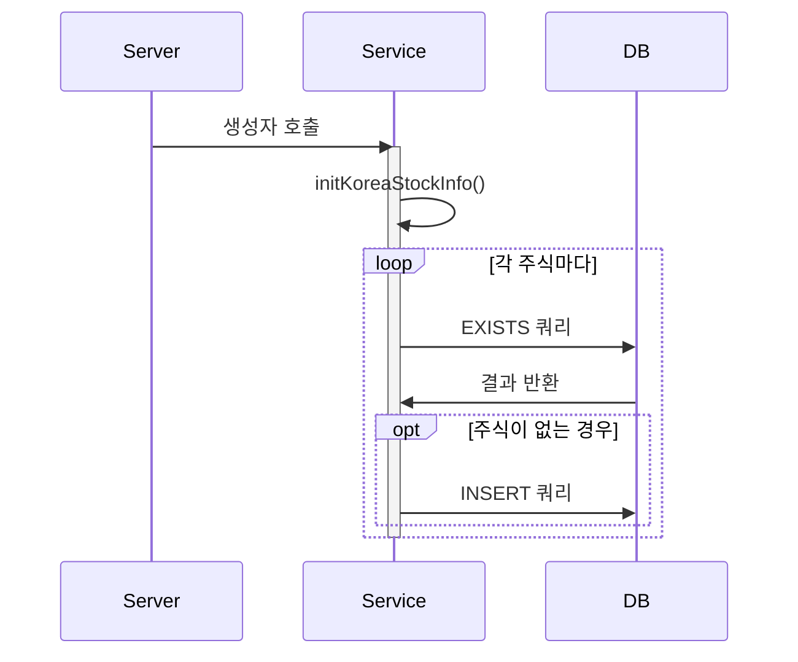
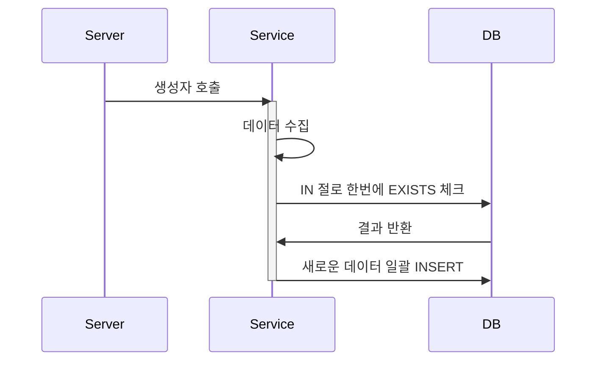

## 🚨 서버 시작하자마자 수천 개의 쿼리가 발생한다고요? - 서버 초기화 시간 90% 개선하기

### 1. 발견된 문제
- typeorm의 로깅을 통해 서버가 시작되자마자 수천 개의 쿼리가 발생하는 문제 발견
```typescript
Query: SELECT 1 AS `row_exists` FROM ... WHERE EXISTS (SELECT 1 FROM `stock` WHERE stock_id = ?) 
Parameters: ["040300"]
Query: SELECT 1 AS `row_exists` FROM ... WHERE EXISTS (SELECT 1 FROM `stock` WHERE stock_id = ?) 
Parameters: ["040350"]
// ... 수천 개의 쿼리 계속 발생
```


### 2. 원인 분석
- 서버 실행시 왜 수천 개의 쿼리가 발생하는지 파악
- 로깅작업이 되어있지 않아 어느 서비스에서 해당 쿼리가 발생하는지 파악이 어려움
- 크론이 도는것일까? onModuleInit()에서 실행되는 것일까? -> 크론과 onModuleInit을 찾아보았으나 해당 로직이 없음
- NestJS의 의존성 주입(DI)시 생성자에서 초기화 작업을 수행하는 것을 원인으로 추정

#### 의존성 주입 과정 분석
1. 서버 시작시 NestJS가 모듈을 스캔
2. `@Injectable()` 데코레이터가 붙은 서비스 클래스 발견
3. 의존성 주입을 위해 해당 클래스의 인스턴스 자동 생성
4. 인스턴스 생성 = 생성자 자동 호출
5. 생성자에서 initKoreaStockInfo() 실행
6. KOSPI, KOSDAQ 데이터 각각 처리
7. 각 주식마다 개별 EXISTS 쿼리 실행
```typescript
@Injectable()
export class KoreaStockInfoService {
    constructor(...) {
        this.initKoreaStockInfo();  // 생성자에서 초기화 메서드 호출
    }

    private async insertStockData(stock: Stock): Promise<void> {
        const exists = await this.existsStockInfo(stock.id!, manager);  // 각각의 주식마다 EXISTS 체크
        if (!exists) {
            await manager.save(Stock, stock);
        }
    }
}
```

### 3. 프로세스 비교

#### 기존 방식 (순차적 실행)


#### 개선된 방식 (배치 처리)


### 4. 개선된 코드
```typescript
// mst파일에 저장된 주식 데이터를 한줄씩 읽어옴
for await (const row of rl) {
  stocks.push({
    id: shortCode,
    name: koreanName,
    views: 0,
    isTrading: true,
    groupCode,
  });
  
  // 배치 크기가 되면 처리
  // out of memory를 방지하기 위해 100개씩 처리
  // 너무적으면 DB 부하가 높아지고, 너무 많으면 메모리 부하가 높아짐
  if (stocks.length >= 100) {
    queryCount++;
    await this.insertStockDataBatch([...stocks]);
    stocks.length = 0;
  }
}

private async insertStockDataBatch(stocks: Stock[]): Promise<void> {
    // 한 번의 쿼리로 존재하는 모든 stock_id 확인
    const existingStocks = await manager
        .createQueryBuilder(Stock, "stock")
        .select("stock.id")
        .where("stock.id IN (:...ids)", { 
            ids: stocks.map(s => s.id) 
        })
        .getRawMany();

    // 새로운 데이터만 필터링
    const existingIds = new Set(existingStocks.map(s => s.id));
    const newStocks = stocks.filter(s => !existingIds.has(s.id));
    
    // 일괄 저장
    if (newStocks.length > 0) {
        await manager.save(Stock, newStocks);
    }
}
```


### 5. 성능 개선 효과
| 항목       | 기존 방식         | 개선된 방식              |
|----------|---------------|---------------------|
| DB 쿼리 수  | 주식 수 × 2 (최대) | 2 (EXISTS + INSERT) |
| 실행 시간    | O(n)          | O(n/batchSize)      |
| 실행 시간 실제 | 약 5000ms      | 약 550ms             |
| DB 부하    | 높음            | 낮음                  |
- 개선전<br>


- 개선후<br>


### 6. 핵심 교훈
1. NestJS는 DI 시점에서 인스턴스 생성 및 초기화 작업이 발생
1. 생성자에서 무거운 초기화 작업 주의
2. 순차적 쿼리보다 배치 처리 활용
3. 데이터베이스 부하 고려한 설계 필요


### 7. 스프링 프레임워크와 비교
- 스프링에서도 Bean 등록시 인스턴스를 만들기 위해 생성자 호출
- 생성자에서 비즈니스 로직을 처리하는 것은 권장하지 않음
- `@PostConstruct` 어노테이션을 통해 초기화 메서드를 별도로 지정하는 방법을 권장!!
```java
@Component
public class MyService {
    @PostConstruct
    public void init() {
        // 초기화 작업
    }
}
```

### 8. 결론

1. **프레임워크 동작 방식의 이해가 중요**
    - NestJS의 의존성 주입 과정을 이해함으로써 문제의 원인을 파악
    - 생성자에서의 초기화 작업이 서버 시작에 미치는 영향 확인

2. **성능 개선의 방향성**
    - 단순한 코드 수정이 아닌, 전체 프로세스를 개선
    - 순차 처리 → 배치 처리로 전환하여 90% 성능 향상 달성
    - 5초 → 0.5초로 서버 초기화 시간 단축

3. **모니터링과 측정의 중요성**
    - typeorm 로깅을 통한 문제 발견
    - 실제 측정값을 통한 개선 효과 검증
